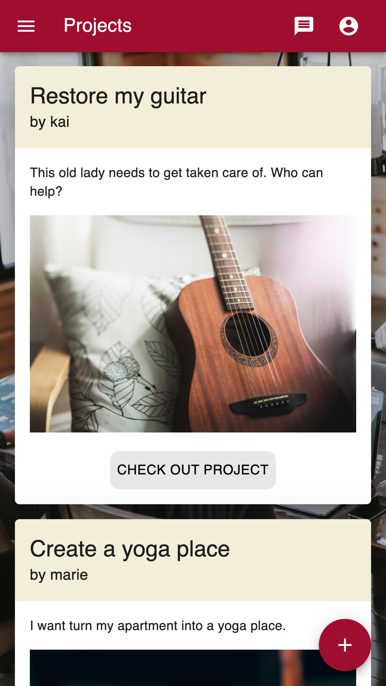

# Projectplace

"Projectplace" is an app that provides a marketplace for people who want to share their skills to work together in projects. You can sign up and add those skills to your profile, you want to share with other people. Any User can search particular skills and contact other users to participate in projects. You can also share project ideas and try to win others for your idea.

This project is my personal final project of the Web Development Bootcamp at "neuefische".

